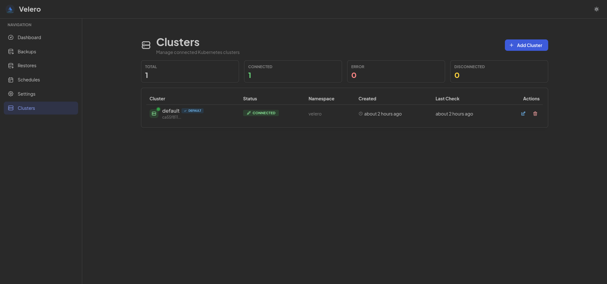
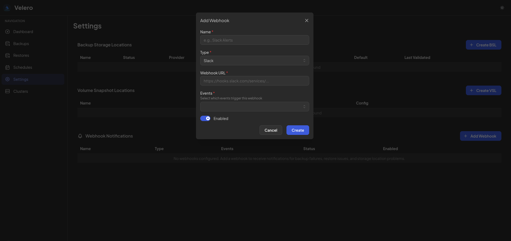

# Velero Dashboard

<div align="center">
  
</div>

<br>

A modern web dashboard for managing [Velero](https://velero.io/) backups in Kubernetes clusters.

## Screenshots

<div align="center">

### Dashboard Overview


### Backup Management
<table>
  <tr>
    <td></td>
    <td></td>
  </tr>
  <tr>
    <td></td>
    <td></td>
  </tr>
</table>

### Schedule Management
<table>
  <tr>
    <td></td>
    <td></td>
  </tr>
</table>

### Multi-Cluster Management


### Settings & Webhook Notifications
<table>
  <tr>
    <td></td>
    <td></td>
  </tr>
  <tr>
    <td></td>
    <td></td>
  </tr>
</table>

</div>

---

Built with **Go** + **Next.js** + **Mantine**, interacting directly with Velero CRDs via the Kubernetes API (no CLI wrapping).

## Features

- **Multi-cluster support** — Manage Velero backups across multiple Kubernetes clusters from a single dashboard
- **Cross-cluster restore** — Detect shared Backup Storage Locations across clusters and restore backups from one cluster to another
- **Dashboard** — Overview with backup stats, success rate, and recent activity
- **Backups** — List, create, view details, and delete backups
- **Restores** — Create restores from completed backups, track progress, with best practices guidance
- **Restore best practices** — Pre-restore checklist, PV/PVC warnings, namespace mapping guidance, post-restore validation guide
- **Schedules** — Create cron-based backup schedules, pause/resume, delete
- **Settings** — View Backup Storage Locations, Volume Snapshot Locations, and Webhook Notifications
- **Webhook notifications** — Alerts to Slack, Microsoft Teams, Discord, or generic webhooks on backup failures, restore failures, and BSL unavailability
- **Real-time** — WebSocket updates on backup/restore status changes
- **Dark mode** — Automatic or manual light/dark theme toggle
- **Notifications** — Toast notifications on backup completion/failure
- **Authentication** — Built-in Basic auth and OIDC (Google, Okta, Keycloak, Azure AD)
- **Token-based auth** — Service account token authentication for managed clusters (GKE, EKS, AKS)
- **Role-based access** — Viewer, Operator, Admin roles with UI and API enforcement
- **Pagination & search** — Client-side filtering and paging on all data tables

## Authentication

The dashboard supports three auth modes configured via the `AUTH_MODE` environment variable:

| Mode | Description |
|------|-------------|
| `none` | No authentication (default, backward compatible). All users get admin access. |
| `basic` | Local username/password authentication with bcrypt hashes |
| `oidc` | OpenID Connect provider (Google, Okta, Keycloak, Azure AD, etc.) |

### Roles

| Role | Permissions |
|------|------------|
| `viewer` | Read-only access — dashboard, lists, details, settings |
| `operator` | CRUD — create/delete backups, restores, schedules |
| `admin` | Full access including settings management |

### Basic Auth Setup

```bash
# Generate a bcrypt hash for your password
htpasswd -nbBC 10 "" "your-password" | tr -d ':\n' | sed 's/$2y/$2a/'

# Set users as env var (user:hash:role, comma-separated)
AUTH_MODE=basic
AUTH_USERS="admin:$2a$10$...:admin,viewer:$2a$10$...:viewer"
JWT_SECRET="your-secret-key"
```

### OIDC Setup

```bash
AUTH_MODE=oidc
JWT_SECRET="your-secret-key"
OIDC_ISSUER="https://accounts.google.com"
OIDC_CLIENT_ID="your-client-id"
OIDC_CLIENT_SECRET="your-client-secret"
OIDC_REDIRECT_URL="https://velero.example.com/api/auth/oidc/callback"
OIDC_ADMIN_GROUPS="velero-admins"
OIDC_OPERATOR_GROUPS="velero-operators"
OIDC_DEFAULT_ROLE="viewer"
```

Groups from the OIDC token's `groups` claim are mapped to roles. Users matching `OIDC_ADMIN_GROUPS` get admin, `OIDC_OPERATOR_GROUPS` get operator, all others get the default role.

## Multi-Cluster Support

The dashboard supports managing Velero backups across multiple Kubernetes clusters from a single installation. This is ideal for:
- **Multi-environment setups** (dev, staging, production)
- **Multi-region deployments** (US, EU, APAC)
- **Multi-tenant architectures** (per-team or per-customer clusters)

### Authentication Methods

The dashboard supports two ways to connect to clusters:

#### 1. Kubeconfig File (Traditional)
Upload or paste a standard kubeconfig file. Works best for:
- Local development clusters (minikube, kind, k3s)
- Direct cluster access with embedded certificates
- Clusters using certificate-based authentication

#### 2. Service Account Token (Recommended for Managed Clusters)
Authenticate using API server URL + bearer token + CA certificate. Ideal for:
- **Managed Kubernetes services** (GKE, EKS, AKS)
- Clusters with exec-based authentication plugins that don't work in server environments
- Long-lived credentials without CLI tool dependencies
- Fine-grained RBAC control

### Quick Setup

**For GKE, EKS, or other managed clusters**, use the automated setup scripts:

```bash
# Google Kubernetes Engine (GKE)
./examples/gke-setup.sh

# Amazon Elastic Kubernetes Service (EKS)
./examples/eks-setup.sh

# Manual setup for any cluster
# See: examples/README.md
```

These scripts:
1. Create a service account with appropriate Velero permissions
2. Generate a long-lived access token
3. Output the API server URL, token, and CA certificate
4. Provide step-by-step instructions for adding the cluster to the dashboard

**Full documentation:** See [`examples/README.md`](examples/README.md) for detailed setup instructions, troubleshooting, and security best practices.

### Storage Backends

| Backend | Use Case | How It Works |
|---------|----------|--------------|
| **SQLite** (default) | Local development, single-node | Encrypted DB file (`clusters.db`) |
| **Kubernetes** | Production in-cluster | ConfigMap for metadata + Secrets for kubeconfigs |
| **Auto** (recommended) | Any | Auto-detects: K8s when in-cluster, SQLite otherwise |

Credentials are encrypted at rest using AES-256-GCM. Set via `CLUSTER_ENCRYPTION_KEY` or auto-generated.

### Adding Clusters

#### Via Dashboard UI
1. Navigate to **Settings → Clusters** (admin-only)
2. Click **"Add Cluster"**
3. Choose authentication method:
   - **Kubeconfig File**: Upload/paste kubeconfig
   - **Service Account Token**: Enter API server, token, and CA cert
4. Set the Velero namespace (usually `velero`)
5. Optionally mark as default cluster
6. Switch between clusters using the dropdown in the header

#### Via Helm (Declarative/GitOps)
Pre-configure clusters in `values.yaml` for GitOps workflows:

```yaml
cluster:
  clusters:
    - name: production
      namespace: velero
      isDefault: true
      secretName: velero-dashboard-cluster-production
    - name: staging
      namespace: velero
      secretName: velero-dashboard-cluster-staging
```

Then create the corresponding Secrets with kubeconfig data:

```bash
kubectl create secret generic velero-dashboard-cluster-production \
  -n velero \
  --from-file=kubeconfig=/path/to/prod-kubeconfig
```

#### Via kubectl (External/GitOps)
Create Secrets with labels and annotations — the dashboard auto-discovers them:

```bash
kubectl create secret generic velero-dashboard-cluster-prod \
  -n velero \
  --from-file=kubeconfig=/path/to/kubeconfig \
  -l app.kubernetes.io/name=velero-dashboard \
  -l app.kubernetes.io/component=cluster-kubeconfig

kubectl annotate secret velero-dashboard-cluster-prod -n velero \
  velero-dashboard/cluster-name=production \
  velero-dashboard/cluster-namespace=velero \
  velero-dashboard/is-default=true
```

The reconciliation loop detects new/deleted Secrets within ~30 seconds and automatically connects or disconnects clusters.

### Cross-Cluster Dashboard

When multiple clusters are connected, the dashboard shows an **"All Clusters Overview"** bar with aggregated stats (total backups, success rate, failures) across all clusters. Notifications for backup/restore failures are shown for **all clusters**, even when viewing a different cluster.

All Velero operations (backups, restores, schedules) are scoped to the selected cluster. The dashboard maintains separate WebSocket connections for real-time updates from each cluster.

### Cross-Cluster Restore

When multiple clusters share the same Backup Storage Location (same provider, bucket, and prefix), backups from one cluster can be restored onto another. This is a native Velero capability — the dashboard detects shared BSLs automatically and provides a guided 4-step workflow:

1. **Select source cluster** — The cluster that owns the backup
2. **Select backup** — Only completed backups from shared BSLs are shown
3. **Select target cluster** — The cluster to restore into (must share the BSL)
4. **Configure** — Namespace mapping, resource filtering, existing resource policy

## Webhook Notifications

The dashboard can send alerts to external services when critical events occur:

| Event | Trigger |
|-------|---------|
| `backup_failed` | Backup enters "Failed" phase |
| `backup_partially_failed` | Backup enters "PartiallyFailed" phase |
| `restore_failed` | Restore enters "Failed" phase |
| `bsl_unavailable` | Backup Storage Location becomes "Unavailable" |

### Supported Webhook Types

| Type | Format |
|------|--------|
| **Slack** | Incoming webhook with color-coded attachments |
| **Microsoft Teams** | Adaptive Card format via webhook connector |
| **Discord** | Embed format with color-coded sidebar |
| **Generic Webhook** | Plain JSON POST for custom integrations |

### Configuration

Webhooks are managed via **Settings → Webhook Notifications** (admin-only). Each webhook can subscribe to specific events and be individually enabled/disabled. A "Send Test" button allows verifying connectivity.

Webhook configurations are stored in:
- **Production (Kubernetes):** ConfigMap for metadata + Secret for URLs (URLs contain auth tokens)
- **Development (local):** SQLite database

The storage backend is auto-detected based on the runtime environment.

## Architecture

```
┌─────────────┐     ┌──────────────────┐     ┌──────────────────┐
│   Browser   │───▶│ Next.js Frontend │───▶│  Go Backend API  │
│  (Mantine)  │     │ :3000 / :3001    │     │  :8080           │
│             │◀───│                  │◀───│                  │
│  WebSocket  │     │ React Query      │     │  Fiber + WS      │
└─────────────┘     └──────────────────┘     └────────┬─────────┘
                                                      │
                                              K8s Dynamic Client
                                                      │
                                             ┌────────▼─────────┐
                                             │ Kubernetes API   │
                                             │ Velero CRDs      │
                                             │ (velero.io/v1)   │
                                             └──────────────────┘
```

**Key design decisions:**
- **No CLI wrapping** — The backend uses `client-go` dynamic client to interact with Velero CRDs directly, avoiding the security risks and fragility of shelling out to the Velero CLI
- **No database** — All data comes from the Kubernetes API in real-time
- **WebSocket informers** — The backend watches Velero resources and broadcasts changes to connected clients

## Tech Stack

| Layer | Technology |
|-------|-----------|
| Backend | Go 1.25, Fiber, client-go, zap |
| Frontend | Next.js 15, Mantine v7, React Query, mantine-datatable |
| Real-time | WebSocket (Fiber + native browser API) |
| Deployment | Helm chart, Docker (distroless), RBAC |
| Tests | Go testing + Vitest |

## Quick Start

### Prerequisites

- **Go** 1.23+
- **Node.js** 22+
- **kubectl** configured with access to a cluster running Velero
- **air** (optional, for backend hot-reload): `go install github.com/air-verse/air@latest`

### Development

```bash
cd velero

# Start everything (backend + frontend with hot-reload)
./dev.sh all

# Or start individually
./dev.sh backend    # Go API on :8080
./dev.sh frontend   # Next.js on :3001

# Check status
./dev.sh status

# Stop everything
./dev.sh stop
```

The backend reads your local `~/.kube/config` and connects to the current context. Make sure Velero is installed in the target cluster.

### Environment Variables

| Variable | Default | Description |
|----------|---------|-------------|
| `KUBECONFIG` | `~/.kube/config` | Path to kubeconfig file (legacy single-cluster mode) |
| `VELERO_NAMESPACE` | `velero` | Namespace where Velero is installed (legacy mode) |
| `CLUSTER_STORAGE_TYPE` | `sqlite` | Cluster storage: `sqlite` or `kubernetes` |
| `CLUSTER_DB_PATH` | `./clusters.db` | SQLite database path for cluster configurations |
| `CLUSTER_ENCRYPTION_KEY` | (auto-generated) | AES-256 encryption key for credentials (base64, 32 bytes) |
| `SERVER_PORT` | `8080` | Backend API port |
| `SERVER_ALLOWED_ORIGINS` | `http://localhost:3000` | CORS allowed origins |
| `BACKEND_URL` | `http://localhost:8080` | Backend URL (used by frontend proxy) |
| `AUTH_MODE` | `none` | Auth mode: `none`, `basic`, `oidc` |
| `JWT_SECRET` | (auto-generated) | Secret for JWT signing (HS256) |
| `JWT_EXPIRATION` | `24h` | JWT token expiration duration |
| `AUTH_USERS` | | Basic mode users: `user:bcrypt_hash:role,...` |
| `OIDC_ISSUER` | | OIDC provider issuer URL |
| `OIDC_CLIENT_ID` | | OIDC client ID |
| `OIDC_CLIENT_SECRET` | | OIDC client secret |
| `OIDC_REDIRECT_URL` | | OIDC callback URL |
| `OIDC_ROLE_CLAIM` | `groups` | OIDC claim for role mapping |
| `OIDC_ADMIN_GROUPS` | `velero-admins` | Groups mapped to admin role |
| `OIDC_OPERATOR_GROUPS` | `velero-operators` | Groups mapped to operator role |
| `OIDC_DEFAULT_ROLE` | `viewer` | Default role for authenticated users |

**Legacy Mode:** When `KUBECONFIG` is set and no clusters exist in the database, the dashboard automatically creates a default cluster using the legacy configuration. This ensures backward compatibility with existing deployments.

## Testing

### Run All Tests

```bash
./dev.sh test
```

### Backend Tests (Go)

```bash
cd backend
go test ./... -v
```

**43 tests** covering:
- CRUD operations for Backups, Restores, Schedules
- Dashboard stats aggregation
- Backup deletion via DeleteBackupRequest CRD
- Schedule pause/resume toggle
- BackupStorageLocation listing
- CRD parsers (unstructured → typed DTOs)
- Auth: JWT generation/validation, role hierarchy, user parsing, OIDC group extraction
- SQLite cluster store: CRUD, encryption, defaults, key generation
- Token-to-kubeconfig conversion (basic, CA cert, insecure TLS)
- Cluster types: ToSummary conversion

Tests use `k8s.io/client-go/dynamic/fake` — no real cluster needed.

### Frontend Tests (Vitest)

```bash
cd frontend
npm run test:run       # Single run
npm run test           # Watch mode
npm run test:coverage  # With coverage report
```

**58 tests** covering:
- API client (fetch wrapper, error handling)
- Utility functions (date formatting, duration, time ago)
- Phase color mapping (11 Velero phases → badge colors)
- Table search hook (filtering, pagination, case-insensitive search)
- Cluster store (Zustand state management, localStorage persistence)
- Cluster API (CRUD operations, token auth, error handling)

### Writing Tests

**Backend:** Add tests in `*_test.go` files next to the code. Use `newTestClient()` from `velero_test.go` for a pre-configured fake K8s client:

```go
func TestMyFeature(t *testing.T) {
    client := newTestClient(t,
        makeBackup("b1", "Completed", 0, 0),
    )
    // test with client...
}
```

**Frontend:** Add tests in `src/__tests__/`. Use `vitest` + `@testing-library/react`:

```typescript
import { describe, it, expect } from "vitest";
import { myFunction } from "@/lib/utils";

describe("myFunction", () => {
  it("does something", () => {
    expect(myFunction("input")).toBe("expected");
  });
});
```

## Deployment

### Helm Chart

```bash
# Lint
cd velero && make helm-lint

# Preview templates
make helm-template

# Install (dry-run first)
make helm-install

# Install for real
helm install velero-dashboard helm/velero-dashboard \
  --namespace velero \
  --set ingress.enabled=true \
  --set ingress.host=velero.example.com
```

### Helm Values

```yaml
# values.yaml overrides
backend:
  image:
    repository: klinux/velero-dashboard-backend
    tag: "1.0.0"

frontend:
  image:
    repository: klinux/velero-dashboard-frontend
    tag: "1.0.0"

velero:
  namespace: velero

ingress:
  enabled: true
  className: nginx
  host: velero.example.com
  annotations:
    cert-manager.io/cluster-issuer: letsencrypt
  tls:
    - secretName: velero-dashboard-tls
      hosts:
        - velero.example.com
```

### RBAC

The Helm chart creates a dedicated `ServiceAccount` + `ClusterRole` with permissions for Velero CRDs and cluster storage:

```yaml
rules:
  # Velero CRDs
  - apiGroups: ["velero.io"]
    resources: [backups, restores, schedules, ...]
    verbs: ["get", "list", "watch", "create", "update", "patch", "delete"]
  # Core resources (read-only)
  - apiGroups: [""]
    resources: ["pods", "pods/log", "namespaces", "persistentvolumes", "persistentvolumeclaims"]
    verbs: ["get", "list", "watch"]
  # Multi-cluster storage (ConfigMap + Secrets)
  - apiGroups: [""]
    resources: ["configmaps"]
    verbs: ["get", "list", "watch", "create", "update", "patch"]
  - apiGroups: [""]
    resources: ["secrets"]
    verbs: ["get", "list", "watch", "create", "update", "patch", "delete"]
```

For tighter security, set `rbac.namespaced: true` in `values.yaml` to use a namespace-scoped `Role` instead of `ClusterRole`.

### Docker Images

```bash
# Build
make build                    # Both images
make build-backend            # Backend only
make build-frontend           # Frontend only

# Build with version tag
make build VERSION=1.0.0

# Push to registry
make push VERSION=1.0.0

# Build + push
make all VERSION=1.0.0
```

### Installing Velero via Helm

Velero provides an [official Helm chart](https://github.com/vmware-tanzu/helm-charts/tree/main/charts/velero) maintained by VMware Tanzu. This is the recommended approach for production and GitOps workflows (ArgoCD, Flux):

```bash
# Add the Velero Helm repository
helm repo add vmware-tanzu https://vmware-tanzu.github.io/helm-charts
helm repo update

# Install Velero (example with AWS/S3)
helm install velero vmware-tanzu/velero \
  --namespace velero --create-namespace \
  --set-file credentials.secretContents.cloud=/path/to/credentials \
  --set configuration.backupStorageLocation[0].provider=aws \
  --set configuration.backupStorageLocation[0].bucket=my-bucket \
  --set configuration.backupStorageLocation[0].config.region=us-east-1 \
  --set initContainers[0].name=velero-plugin-for-aws \
  --set initContainers[0].image=velero/velero-plugin-for-aws:v1.10.0 \
  --set initContainers[0].volumeMounts[0].mountPath=/target \
  --set initContainers[0].volumeMounts[0].name=plugins
```

**ArgoCD ApplicationSet** — Deploy Velero + Dashboard to all clusters:

```yaml
# Velero itself (official chart)
apiVersion: argoproj.io/v1alpha1
kind: Application
metadata:
  name: velero
spec:
  source:
    repoURL: https://vmware-tanzu.github.io/helm-charts
    chart: velero
    targetRevision: "11.3.2"
    helm:
      values: |
        configuration:
          backupStorageLocation:
            - provider: aws
              bucket: my-bucket
              config:
                region: us-east-1
  destination:
    namespace: velero

---
# Velero Dashboard
apiVersion: argoproj.io/v1alpha1
kind: Application
metadata:
  name: velero-dashboard
spec:
  source:
    repoURL: https://your-registry/charts
    chart: velero-dashboard
    targetRevision: "1.0.0"
  destination:
    namespace: velero
```

### Local Testing with Kind + Velero

If you don't have a cluster with Velero, you can set one up locally:

```bash
# Create local cluster
kind create cluster --name velero-test

# Install MinIO (S3-compatible storage)
kubectl apply -f https://raw.githubusercontent.com/vmware-tanzu/velero/main/examples/minio/00-minio-deployment.yaml

# Create credentials file
cat > /tmp/minio-credentials <<EOF
[default]
aws_access_key_id = minio
aws_secret_access_key = minio123
EOF

# Install Velero
velero install \
  --provider aws \
  --bucket velero \
  --secret-file /tmp/minio-credentials \
  --plugins velero/velero-plugin-for-aws:v1.10.0 \
  --backup-location-config region=minio,s3ForcePathStyle=true,s3Url=http://minio.velero.svc:9000 \
  --use-volume-snapshots=false

# Verify
kubectl get pods -n velero
kubectl get bsl -n velero

# Now start the dashboard
cd velero && ./dev.sh all
```

## API Endpoints

| Method | Path | Auth | Description |
|--------|------|------|-------------|
| GET | `/healthz` | Public | Health check |
| GET | `/api/auth/config` | Public | Auth mode configuration |
| POST | `/api/auth/login` | Public | Basic auth login |
| GET | `/api/auth/oidc/login` | Public | OIDC login redirect |
| GET | `/api/auth/oidc/callback` | Public | OIDC callback |
| GET | `/api/auth/me` | Viewer+ | Current user info |
| GET | `/api/clusters` | Viewer+ | List all clusters |
| GET | `/api/clusters/:id` | Viewer+ | Get cluster details |
| POST | `/api/clusters` | Admin | Add a new cluster |
| PATCH | `/api/clusters/:id` | Admin | Update cluster configuration |
| DELETE | `/api/clusters/:id` | Admin | Remove a cluster |
| GET | `/api/dashboard/stats` | Viewer+ | Aggregated statistics |
| GET | `/api/backups?cluster=<id>` | Viewer+ | List backups (optional cluster filter) |
| GET | `/api/backups/:name?cluster=<id>` | Viewer+ | Get backup details |
| POST | `/api/backups?cluster=<id>` | Operator+ | Create a backup |
| DELETE | `/api/backups/:name?cluster=<id>` | Operator+ | Delete a backup |
| GET | `/api/restores?cluster=<id>` | Viewer+ | List restores |
| GET | `/api/restores/:name?cluster=<id>` | Viewer+ | Get restore details |
| POST | `/api/restores?cluster=<id>` | Operator+ | Create a restore |
| POST | `/api/restores/cross-cluster` | Operator+ | Create cross-cluster restore |
| GET | `/api/backups/shared` | Viewer+ | List backups available across clusters via shared BSLs |
| GET | `/api/schedules?cluster=<id>` | Viewer+ | List schedules |
| GET | `/api/schedules/:name?cluster=<id>` | Viewer+ | Get schedule details |
| POST | `/api/schedules?cluster=<id>` | Operator+ | Create a schedule |
| PATCH | `/api/schedules/:name?cluster=<id>` | Operator+ | Toggle pause/resume |
| DELETE | `/api/schedules/:name?cluster=<id>` | Operator+ | Delete a schedule |
| GET | `/api/settings/backup-locations?cluster=<id>` | Viewer+ | List BSLs |
| GET | `/api/settings/snapshot-locations?cluster=<id>` | Viewer+ | List VSLs |
| GET | `/api/settings/server-info` | Viewer+ | Dashboard version and config |
| GET | `/api/notifications/webhooks` | Admin | List webhook configurations |
| POST | `/api/notifications/webhooks` | Admin | Create a webhook |
| PATCH | `/api/notifications/webhooks/:id` | Admin | Update a webhook |
| DELETE | `/api/notifications/webhooks/:id` | Admin | Delete a webhook |
| POST | `/api/notifications/webhooks/:id/test` | Admin | Send test notification |
| WS | `/ws` | Token | Real-time events (tagged with cluster ID) |

**Note:** All Velero resource endpoints accept an optional `?cluster=<id>` query parameter. If omitted, the default cluster is used (for backward compatibility).

## Project Structure

```
velero/
├── dev.sh                      # Development script (like FuseOne)
├── Makefile                    # Build, push, test, helm targets
├── docker-compose.yml          # Dev environment
├── LICENSE                     # MIT
├── CONTRIBUTING.md             # PR guidelines and code of conduct
│
├── examples/                   # Cluster setup examples
│   ├── README.md               # Detailed setup guides
│   ├── gke-setup.sh            # GKE service account automation
│   └── eks-setup.sh            # EKS service account automation
│
├── backend/
│   ├── cmd/server/main.go      # Entry point, routes, lifecycle
│   ├── internal/
│   │   ├── config/config.go    # Env-based configuration
│   │   ├── auth/               # Authentication package
│   │   │   ├── auth.go         # Interface, roles, hierarchy
│   │   │   ├── jwt.go          # JWT generation/validation
│   │   │   ├── middleware.go   # Auth + role middleware
│   │   │   ├── none.go         # No-auth provider (default)
│   │   │   ├── basic.go        # Username/password provider
│   │   │   ├── oidc.go         # OIDC provider
│   │   │   └── auth_test.go    # 8 test functions
│   │   ├── cluster/            # Multi-cluster management
│   │   │   ├── types.go        # Cluster models
│   │   │   ├── store.go        # Storage interface + factory
│   │   │   ├── store_sqlite.go # SQLite implementation (dev)
│   │   │   ├── store_kubernetes.go # K8s ConfigMap+Secret (production)
│   │   │   ├── manager.go      # ClusterManager (orchestration + reconciliation)
│   │   │   └── kubeconfig.go   # Token-to-kubeconfig converter
│   │   ├── k8s/
│   │   │   ├── client.go       # K8s client (kubeconfig + token auth)
│   │   │   ├── velero.go       # Velero CRD CRUD operations
│   │   │   ├── informers.go    # Watch loop → WebSocket broadcast + notification dispatch
│   │   │   ├── types.go        # Request/Response DTOs
│   │   │   └── velero_test.go  # 15 unit tests
│   │   ├── notification/       # Webhook notification system
│   │   │   ├── types.go        # Webhook config, event types
│   │   │   ├── store.go        # Storage interface + factory
│   │   │   ├── store_sqlite.go # SQLite implementation (dev)
│   │   │   ├── store_kubernetes.go # K8s ConfigMap+Secret (production)
│   │   │   ├── notifier.go     # Notification manager (dispatch + metrics)
│   │   │   ├── adapter.go      # EventNotifier interface bridge
│   │   │   ├── slack.go        # Slack webhook sender
│   │   │   ├── teams.go        # Microsoft Teams webhook sender
│   │   │   ├── discord.go      # Discord webhook sender
│   │   │   └── webhook.go      # Generic webhook sender
│   │   ├── handler/            # HTTP handlers
│   │   │   ├── cluster.go      # Cluster CRUD endpoints (admin-only)
│   │   │   ├── notification.go # Webhook CRUD + test endpoints
│   │   │   └── cross_cluster.go # Shared backups + cross-cluster restore
│   │   ├── middleware/cors.go
│   │   ├── metrics/metrics.go  # Prometheus metrics (Velero + webhook delivery)
│   │   └── ws/hub.go           # WebSocket connection manager
│   ├── Dockerfile
│   └── Makefile
│
├── frontend/
│   ├── src/
│   │   ├── app/                # Next.js App Router pages
│   │   │   ├── page.tsx        # Dashboard
│   │   │   ├── login/          # Login page (basic + OIDC)
│   │   │   ├── auth/callback/  # OIDC callback handler
│   │   │   ├── clusters/       # Cluster management (admin)
│   │   │   ├── backups/        # Backup list, detail, create
│   │   │   ├── restores/       # Restore list, create
│   │   │   ├── schedules/      # Schedule list, create
│   │   │   └── settings/       # BSL + VSL configuration
│   │   ├── components/         # Reusable UI components
│   │   │   ├── cluster-selector.tsx       # Header cluster dropdown
│   │   │   ├── create-cluster-modal.tsx   # Add cluster modal
│   │   │   ├── edit-cluster-modal.tsx     # Edit cluster modal
│   │   │   └── webhook-config-modal.tsx   # Webhook create/edit modal
│   │   ├── hooks/              # React Query + WebSocket hooks
│   │   │   ├── use-clusters.ts # Cluster management hooks
│   │   │   ├── use-restores.ts # Restore + cross-cluster restore hooks
│   │   │   └── use-webhooks.ts # Webhook CRUD hooks
│   │   ├── lib/                # API client, auth store, types, utilities
│   │   │   └── cluster.ts      # Zustand cluster state
│   │   └── __tests__/          # 58 Vitest tests
│   ├── Dockerfile
│   └── vitest.config.ts
│
└── helm/velero-dashboard/      # Helm chart
    ├── Chart.yaml
    ├── values.yaml
    └── templates/              # K8s manifests + RBAC
```

## Roadmap

- [x] Authentication (Basic + OIDC with role-based access)
- [x] Backup log viewer (via DownloadRequest CRD)
- [x] Backup/restore progress bar (real-time via WebSocket)
- [x] Spotlight search (Cmd+K) for quick navigation
- [x] Backup size metrics and storage usage charts
- [x] Backup comparison (diff between two backups)
- [x] Multi-cluster support (kubeconfig + token authentication)
- [x] Kubernetes ConfigMap/Secret storage for cluster configurations
- [x] Cross-cluster aggregated dashboard stats
- [x] Real-time notifications for backup/restore failures (all clusters)
- [x] GitOps/declarative cluster provisioning with reconciliation loop
- [x] Prometheus metrics endpoint (`/metrics`)
- [x] API rate limiting
- [x] Webhook notifications (Slack, Teams, Discord, generic)
- [x] Cross-cluster restore via shared BSLs
- [x] Restore best practices panel and post-restore validation guide

## Contributing

See [CONTRIBUTING.md](CONTRIBUTING.md) for guidelines, code of conduct, and PR requirements.

## License

[MIT](LICENSE) - Kleber Rocha
